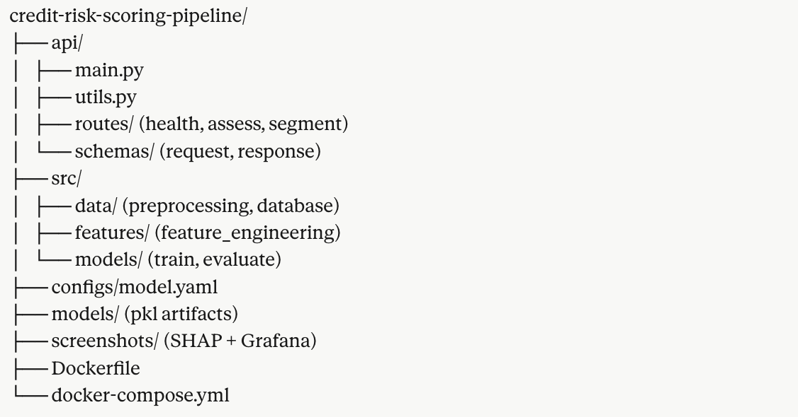

# Week 5 — Credit Risk Scoring Pipeline

**Author:** Martin James Ng'ang'a | [github.com/M20Jay](https://github.com/M20Jay)  
**Status:** ✅ Week 5 of 15 — Complete  
**Stack:** XGBoost · SHAP · DVC · RFM · FastAPI · PostgreSQL · Grafana · Docker · Render

---

## Live API

**Documentation:** https://martin-mlops.com/credit/docs

| Endpoint | Method | Description |
|----------|--------|-------------|
| /health | GET | API health check |
| /assess | POST | Credit risk + propensity scoring |
| /segment | POST | RFM customer segment |

---

## Business Problem

A bank needs to answer three questions simultaneously for every customer:

1. **Will they default on a loan?** — Credit risk score
2. **Will they accept a loan offer?** — Propensity score
3. **How valuable are they?** — RFM customer segment

This API answers all three in one call — with SHAP explainability for every decision.


## Where This Fits

A probability-of-default score is not a lending decision. It's one input into a much larger system:

- **Underwriting / policy engine** — the score combines with hard rules a credit team already set (debt-to-income caps, loan-to-value limits). The model feeds the rules engine, doesn't decide alone.
- **Risk-based pricing engine** — the score determines the interest rate offered, not just approve/deny. This is a revenue decision, not just a risk one.
- **Loan Origination System (LOS)** — the score plugs into the actual system bank staff use to process applications end to end.
- **Basel III — Risk-Weighted Assets** — every loan's risk score feeds how much capital the bank must legally hold in reserve against it.
- **Credit bureau reporting** — in Kenya, CRB. The outcome affects the applicant's future credit history everywhere else.
- **Feedback loop** — the actual repayment outcome, months later, becomes the new label that retrains the model.

This API owns the scoring stage. It's explicitly designed to hand off cleanly into the four stages above it.

---


## Dataset

📁 LendingClub — 421MB — real loan application data

---

## Week 5 Daily Progress

| Day | Task | Status |
|-----|------|--------|
| Day 1 | EDA — loan.csv, target variable, distributions | ✅ Complete |
| Day 2 | XGBoost + calibration + ADASYN + threshold | ✅ Complete |
| Day 3 | src/ modular structure + SHAP explainability | ✅ Complete |
| Day 4 | Propensity scoring + RFM segmentation + DVC | ✅ Complete |
| Day 5 | FastAPI — /health, /assess, /segment endpoints | ✅ Complete |
| Day 6 | Docker + PostgreSQL + Grafana dashboard | ✅ Complete |
| Day 7 | Render deployment + README + LinkedIn post | ✅ Complete |

---

## Day 1 Key Findings

| Finding | Detail |
|---------|--------|
| Total dataset | 887,379 loans — 74 features |
| Modelling dataset | 252,971 loans — Fully Paid and Charged Off only |
| Default rate | 17.9% — moderate class imbalance |
| Strongest predictor | Loan grade — A=5% default, G=42% default |
| File format | Converted CSV 421MB → Parquet 36MB — 11x smaller |
| New features | dti_clean · credit_history_years · loan_to_income |

---

## Day 2 Key Findings

| Metric | Result |
|--------|--------|
| Best model | XGBoost — ROC-AUC 0.703 |
| Optimal threshold | 0.183 — business driven |
| Recall on defaulters | 65% — met requirement |
| False negatives | 3,164 missed defaulters |
| False positives | 14,760 wrongly declined |
| ADASYN applied | 27,149 → 135,353 minority samples |
| Model saved | models/credit_risk_model.pkl |

---

## Day 3 Key Findings

| Item | Detail |
|------|--------|
| Structure | Modular src/ — preprocessing, features, models |
| SHAP | Summary and waterfall plots generated |
| ROC-AUC | 0.703 on held-out test set |
| Threshold | 0.183 — business driven |
| Screenshots | confusion_matrix · shap_summary · shap_waterfall |

---

## Day 4 Key Findings

| Item | Detail |
|------|--------|
| Propensity | Mean propensity score 0.821 on test set |
| RFM | Proxy features — recency, frequency, monetary |
| RFM Segments | Platinum, Gold, Silver, At Risk via KMeans |
| DVC | Tracking models/ and data/ artifacts |
| Limitation | RFM uses proxy features — no transaction history |

---

## Day 5 Key Findings

| Item | Detail |
|------|--------|
| Endpoints | GET /health · POST /assess · POST /segment |
| Structure | Modular — routes/ · schemas/ · utils.py |
| Schemas | LoanApplication · AssessResponse · SegmentResponse |
| utils.py | Shared feature engineering — DRY principle |
| Docs | Auto-generated at /docs — Swagger UI |
| Status | All endpoints tested and returning responses |

---

## Day 6 Key Findings

| Item | Detail |
|------|--------|
| Docker | API + PostgreSQL + Grafana — all containerised |
| PostgreSQL | Stores every prediction — loan_amnt, grade, default_prob, RFM |
| Grafana | 6 panels — total predictions, decline rate, approve vs decline, avg default prob, avg loan amount, time series |
| RFM Storage | rfm_recency · rfm_frequency · rfm_monetary stored per prediction |
| Screenshots | grafana_dashboard_full · grafana_piechart |

---

## Day 7 Key Findings

| Item | Detail |
|------|--------|
| Deployment | Render — Docker runtime |
| Live URL | https://martin-mlops.com/credit/docs |
| Health check | /health returning 200 OK live |
| Assess endpoint | /assess returning predictions live |
| Threshold | 0.183 — consistent local and production |

---

## Sample API Response

```json
{
  "default_probability": 0.207,
  "credit_risk_score": 79.3,
  "propensity_score": 0.793,
  "recommendation": "Decline",
  "threshold_used": 0.183,
  "timestamp": "2026-05-04T16:25:14.285297"
}
```

---

## Stack

| Tool | Purpose |
|------|---------|
| XGBoost | Credit risk and propensity models |
| SHAP | Explainability — why each decision was made |
| DVC | Data version control |
| RFM | Customer segmentation — Recency, Frequency, Monetary |
| FastAPI | Serves all three models in one API call |
| PostgreSQL | Stores every prediction with timestamp |
| Grafana | Live monitoring dashboard — 6 panels |
| Docker | Containerisation — API + PostgreSQL + Grafana |
| Render | Deployment — live production URL |

---

## Why SHAP Matters for Banking

Regulators require banks to explain every loan decision.  
Feature importance tells you what matters globally.  
SHAP tells you **why this specific customer was declined**.

---

## Project Structure



---

*Building from Nairobi. Deployed to the world. 🇰🇪*